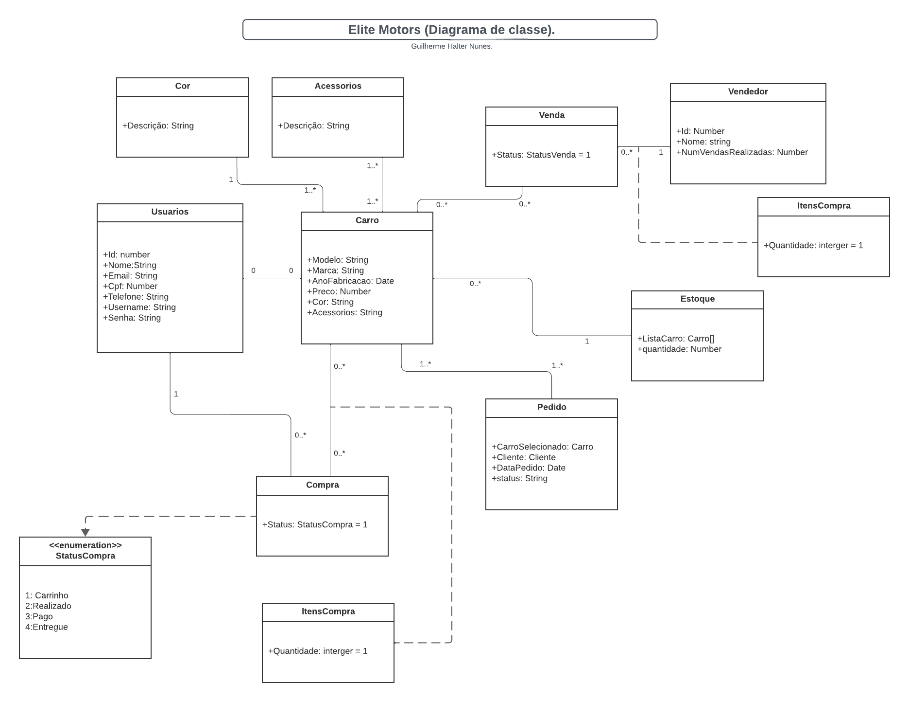

# Projeto Elite Motors

### Elite-Motors-Project

O projeto consiste no desenvolvimento e organização de sistemas Front-end e Back-end para o Elite Motors, um site de venda de carros premium. A proposta estabelecida para o projeto é um Sistema de Controle de Vendas de Carros, elaborado com o objetivo de atender aos requisitos de aparência, funcionalidade, resolução de problemas, organização do grupo e apresentação.

**Feito por:**

- [Gilherme Halter Nunes](https://github.com/GuilhermeHalter)
  
Links do projeto:

- [Documentação (esse documento)](https://github.com/GuilhermeHalter/Projeto_EliteMotors.git)
- Backend: [Repositório](https://github.com/GuilhermeHalter/Projeto_EliteMotors.git) e [Publicação]()
- Frontend-Mobile: [Repositório](https://github.com/GuilhermeHalter/Projeto_EliteMotors.git) e [Publicação]()
- Frontend-web: [Repositório](https://github.com/GuilhermeHalter/Projeto_EliteMotors.git) e [Publicação]()

## Desenvolvimento do Projeto

O Elite Motors Sales Control System é um sistema desenvolvido para facilitar a venda de carros premium. Este sistema visa otimizar o processo desde a exibição dos carros até a conclusão da transação de venda. Ele oferece funcionalidades abrangentes, incluindo cadastro de carros, pesquisa por clientes, registro de vendas, avaliação de desempenho e relatórios estatísticos.

**Motivo da Escolha:**

Considerando o contexto do projeto proposto, o Elite Motors Sales Control System é a escolha ideal, pois atende diretamente às necessidades da Elite Motors, a empresa especializada em carros premium. Ao optar por esse modelo, estamos alinhando o sistema de desenvolvimento às especificidades do processo de vendas, proporcionando uma experiência aprimorada para clientes, vendedores e gerentes. O sistema será uma ferramenta eficaz para gerenciar o inventário, as vendas e fornecer insights para melhorar o desempenho.

## Situação Problema
Atualmente, a Elite Motors enfrenta desafios significativos em relação à eficiência operacional na venda de carros premium. O processo manual desde a exibição dos carros até a conclusão da venda tem se mostrado suscetível a erros, atrasos e falta de integração. A seguir, detalhamos a situação-problema em diferentes aspectos:

**Cadastro de Carros e Inventário:**

O cadastro de novos carros e a atualização do inventário são realizados manualmente, demandando tempo e esforço da equipe de vendas.
A falta de um sistema centralizado dificulta o acompanhamento do status de cada carro no estoque.

**Pesquisa e Atendimento aos Clientes:**

A pesquisa por carros disponíveis é descentralizada, o que pode resultar em informações desatualizadas e falta de padronização.
O atendimento aos clientes carece de uma ferramenta integrada para registrar suas preferências, facilitando futuras recomendações.

**Registro de Vendas e Avaliação de Desempenho:**

O processo de registro de vendas é manual e propenso a erros devido à falta de automatização.
A avaliação de desempenho da equipe de vendas é realizada de maneira subjetiva e não estruturada.

**Relatórios Estatísticos e Tomada de Decisões:**

A geração de relatórios estatísticos para análise de desempenho é um processo demorado e suscetível a erros.
A falta de dados consolidados dificulta a tomada de decisões estratégicas para melhorar as vendas.

## Descrição da Proposta
O Elite Motors Sales Control System proposto visa transformar a venda de carros premium pela Elite Motors, solucionando os desafios identificados na situação-problema. Este software será uma ferramenta centralizada, intuitiva e eficiente, abordando as áreas críticas do processo de vendas de carros premium.
O software se concentrará na automação e otimização das etapas-chave da venda de carros, desde o cadastro de carros até o registro de vendas e avaliação de desempenho. Ele proporcionará uma experiência integrada, cobrindo aspectos como exibição do inventário, pesquisa por clientes, registro de vendas, avaliação de desempenho e geração de relatórios estatísticos.

### Níveis de Usuário:

**Clientes:**

Pesquisa por carros disponíveis no inventário.</br>
Registro de preferências para futuras recomendações.</br>
Visualização do histórico de compras e serviços realizados.

**Vendedores:**

Cadastro de novos carros e atualização do inventário.</br>
Atendimento aos clientes com base em suas preferências registradas.</br>
Registro de vendas e acompanhamento do status.

**Gerentes:**

Geração de relatórios estatísticos para análise de desempenho.</br>
Avaliação de desempenho da equipe de vendas.</br>
Tomada de decisões estratégicas para melhorar as vendas.

## Regras de Negócio
(As regras de negócio podem ser adaptadas conforme as especificidades do projeto "Elite Motors".)

## Requisitos Funcionais
**RF001:** Cadastro de Carros

Descrição: O sistema deve permitir o cadastro de novos carros, fornecendo informações detalhadas sobre cada veículo.</br>
Dados Necessários: Modelo, Marca, Ano de Fabricação, Preço, Cor, Número de Portas, etc.</br>
Usuários: Vendedores.

**RF002:** Pesquisa por Carros Disponíveis

Descrição: Os clientes devem ser capazes de pesquisar por carros disponíveis no inventário com base em critérios como modelo, marca, ano, etc.</br>
Dados Necessários: Critérios de Pesquisa (Modelo, Marca, Ano, etc.).</br>
Usuários: Clientes.

**RF003:** Registro de Vendas

Descrição: O sistema deve permitir o registro de vendas, incluindo informações sobre o cliente, o carro vendido e os detalhes da transação.</br>
Dados Necessários: Cliente, Carro Vendido, Valor da Transação, Data da Venda, etc.</br>
Usuários: Vendedores.

**RF004:** Avaliação de Desempenho da Equipe

Descrição: Os gerentes devem poder avaliar o desempenho da equipe de vendas com base em critérios predefinidos, como número de vendas, satisfação do cliente, etc.</br>
Dados Necessários: Critérios de Avaliação (Número de Vendas, Satisfação do Cliente, etc.).</br>
Usuários: Gerentes.

**RF005**: Geração de Relatórios Estatísticos

Descrição: O sistema deve gerar automaticamente relatórios estatísticos para análise de desempenho da equipe de vendas, inventário de carros e outras métricas relevantes.</br>
Dados Necessários: Métricas de Desempenho, Dados do Inventário, etc.</br>
Usuários: Gerentes.

## Requisitos Não Funcionais
(Adaptar os requisitos não funcionais conforme as necessidades específicas do projeto "Elite Motors".)

## Diagrama de Classe



## Sobre o Projeto
O projeto contém um repositório com 3 arquivos diferentes:

Mobile: Um projeto front-end em React Native.

Web: Um projeto front-end em Vue.js.

Backend: Um projeto back-end em Django REST framework (DRF) com PDM.

Documentacao: Documentação do Projeto.

## Padronização de Commits
Este projeto segue os devidos padrões de Commit:

```bash
    <tipo>(<escopo>): <mensagem>
```
Onde:

tipo: descreve a natureza do commit (por exemplo, feat para uma nova funcionalidade, fix para correção de bugs, docs para documentação e create para criação de projeto).
escopo: opcional, refere-se à parte do projeto afetada pela mudança.
mensagem: é uma descrição concisa e clara da alteração.

**Alguns exemplos de padronização dos commits:**

Criando projeto ou arquivo:

```bash
    git commit -m "create(main): criação da main"
```    
Adicionando uma nova funcionalidade:

```bash

    git commit -m "feat(auth): adiciona autenticação de usuário"
```
Corrigindo um bug:

```bash
    git commit -m "fix(nav): corrige problema de navegação no menu"
```
Atualizando a documentação:

```bash
    git commit -m "docs(readme): atualiza instruções de instalação"
```
Refatorando código:

```bash
    git commit -m "refactor(utils): otimiza função de manipulação de strings"
```
Removendo Arquivo:

```bash
    git commit -m "delete(src): deletando arquivos"
```
## Comandos Úteis e Plugins
**Comandos Vue:**

```bash
    npm install vue-router
```
```bash
    npm install pinia
```
```bash
    npm install axios
```

**Comandos React:**

(Adaptar conforme as tecnologias específicas do projeto "Elite Motors".)

**Plugins:**

(Assim como os comandos, adaptar conforme as tecnologias específicas do projeto "Elite Motors".)

Isso deve fornecer uma estrutura inicial para a documentação do projeto "Elite Motors". Lembre-se de personalizar conforme as necessidades específicas do projeto e da equipe.

